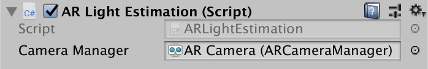

### ARLightEstimation

This component is used to copy over the light estimation data from the [`ARCameraManager`](https://docs.unity3d.com/Packages/com.unity.xr.arfoundation@3.0/api/UnityEngine.XR.ARFoundation.ARCameraFrameEventArgs.html)'s `FrameChanged` event. The properties that will be copied over are the `averageBrightness`, `averageColorTemperature` and `colorCorrection`. This component must be added to game object with a `Directional Light` component.

