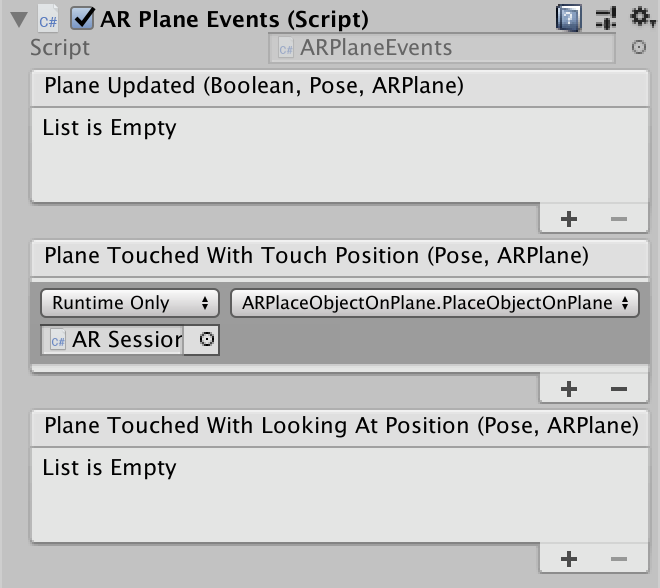

### ARPlaneEvents

#### Events

| Name | Attributes | Description |
| ---- | ---------- | ----------- |
| `PlaneUpdated` | `Pose`, `ARPlane` | Fires whenever an `ARPlane` is visible. |
| `PlaneTouchedWithTouchPosition` | `Pose`, `ARPlane` | Fires whenever an `ARPlane` is visible and is touched. |
| `PlaneTouchedWithLookingAtPosition` | `Pose`, `ARPlane` | Fires whenever an `ARPlane` is visible and the screen is touched. |

