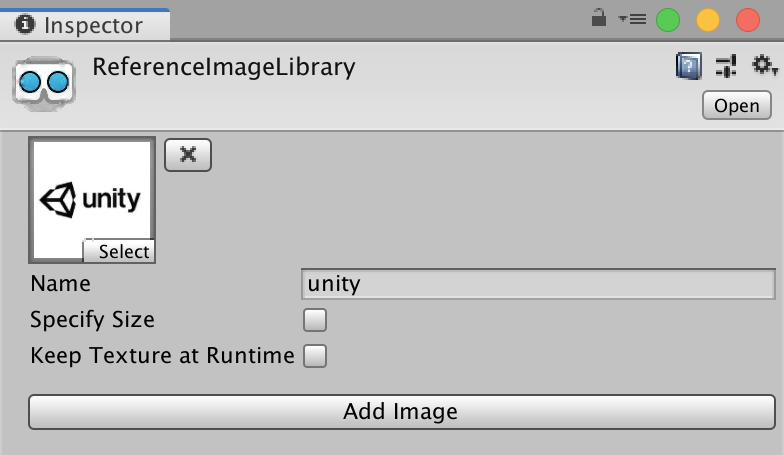

### ARTrackedImageEvents

A component used to track image targets in AR. Image targets are managed through the [XRReferenceImageLibrary](https://docs.unity3d.com/Packages/com.unity.xr.arsubsystems@3.0/api/UnityEngine.XR.ARSubsystems.XRReferenceImageLibrary.html) scriptable object.

#### Events

| Name                  | Attributes       | Description                                                    |
| --------------------- | ---------------- | -------------------------------------------------------------- |
| `TrackedImageAdded`   | `ARTrackedImage` | Fires whenever an `ARTrackedImage` is first tracked.           |
| `TrackedImageUpdated` | `ARTrackedImage` | Fires whenever an `ARTrackedImage` is tracked and updated.     |
| `TrackedImageRemoved` | `ARTrackedImage` | Fires whenever an `ARTrackedImage` is no longer being tracked. |

