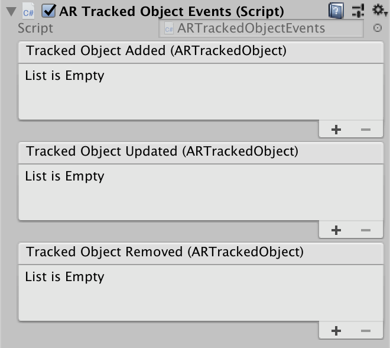

### ARTrackedObjectEvents

A component used to track objects targets in AR. Object targets are managed through the [XRReferenceObjectLibrary](https://docs.unity3d.com/Packages/com.unity.xr.arsubsystems@3.0/api/UnityEngine.XR.ARSubsystems.XRReferenceObjectLibrary.html) scriptable object.

#### Events

| Name | Attributes | Description |
| ---- | ---------- | ----------- |
| `TrackedObjectAdded` | `ARTrackedObject` | Fires whenever an `ARTrackedObject` is first tracked. |
| `TrackedObjectUpdated` | `ARTrackedObject` | Fires whenever an `ARTrackedObject` is tracked and updated. |
| `TrackedObjectRemoved` | `ARTrackedObject` | Fires whenever an `ARTrackedObject` is no longer being tracked. |

